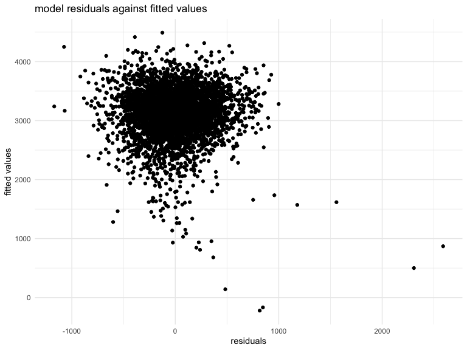
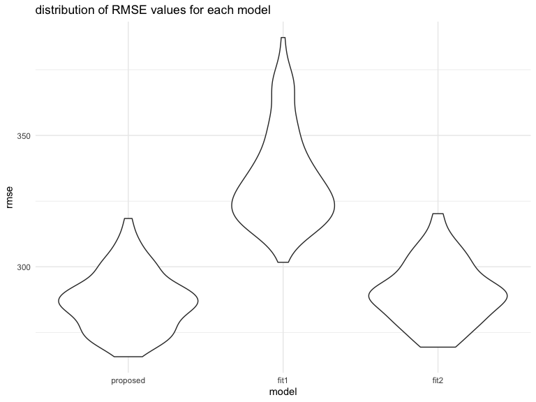

p8105\_hw6\_jl5548
================
J L
November 14, 2019

Problem 1
---------

**Load and clean the data for regression analysis (i.e. convert numeric to factor where appropriate, check for missing data, etc.).**

``` r
# load and clean variable names
df_birthweight_origin = read_csv("./data/birthweight.csv") %>% 
  janitor::clean_names() 
```

    ## Parsed with column specification:
    ## cols(
    ##   .default = col_integer(),
    ##   gaweeks = col_double(),
    ##   ppbmi = col_double(),
    ##   smoken = col_double()
    ## )

    ## See spec(...) for full column specifications.

``` r
# tidy data and store in another dataframe
df_birthweight = df_birthweight_origin %>% 
  mutate(  # convert numeric to factor, and categorize to corresponding label
    babysex = factor(
      case_when(
        babysex == 1 ~ "male",
        babysex == 2 ~ "female"
      )
    ), 
    frace = factor(
      case_when(
        frace == 1 ~ "White",
        frace == 2 ~ "Black",
        frace == 3 ~ "Asian",
        frace == 4 ~ "Puerto Rican",
        frace == 8 ~ "Other",
        frace == 9 ~ "Unknown"
      )
    ),
    malform = factor(
      case_when(
        malform == 0 ~ "absent",
        malform == 1 ~ "present"
      )
    ), 
    mrace = factor(
      case_when(
        mrace == 1 ~ "White",
        mrace == 2 ~ "Black",
        mrace == 3 ~ "Asian",
        mrace == 4 ~ "Puerto Rican",
        mrace == 8 ~ "Other"
      )
    )
  )

# check for missing data
anyNA(df_birthweight)
```

    ## [1] FALSE

``` r
# display tidied dataset
df_birthweight
```

    ## # A tibble: 4,342 x 20
    ##    babysex bhead blength   bwt delwt fincome frace gaweeks malform menarche
    ##    <fct>   <int>   <int> <int> <int>   <int> <fct>   <dbl> <fct>      <int>
    ##  1 female     34      51  3629   177      35 White    39.9 absent        13
    ##  2 male       34      48  3062   156      65 Black    25.9 absent        14
    ##  3 female     36      50  3345   148      85 White    39.9 absent        12
    ##  4 male       34      52  3062   157      55 White    40   absent        14
    ##  5 female     34      52  3374   156       5 White    41.6 absent        13
    ##  6 male       33      52  3374   129      55 White    40.7 absent        12
    ##  7 female     33      46  2523   126      96 Black    40.3 absent        14
    ##  8 female     33      49  2778   140       5 White    37.4 absent        12
    ##  9 male       36      52  3515   146      85 White    40.3 absent        11
    ## 10 male       33      50  3459   169      75 Black    40.7 absent        12
    ## # … with 4,332 more rows, and 10 more variables: mheight <int>,
    ## #   momage <int>, mrace <fct>, parity <int>, pnumlbw <int>, pnumsga <int>,
    ## #   ppbmi <dbl>, ppwt <int>, smoken <dbl>, wtgain <int>

**Propose a regression model for birthweight. This model may be based on a hypothesized structure for the factors that underly birthweight, on a data-driven model-building process, or a combination of the two. Describe your modeling process and show a plot of model residuals against fitted values – use add\_predictions and add\_residuals in making this plot.**

I proposed that baby's birth weight as an outcome that may depend on baby's head circumference at birth, baby's length at birth, and mother's weight at delivery. I fit the initial proposed model in the following code chunk using lm() function.

``` r
## propose a regression model for birthweight (outcome), with bhead, blength, delwt as predictors
model_proposed = lm(bwt ~ bhead + blength + delwt, data = df_birthweight) 
## use the broom package to tidy the coefficient table and reveal results
model_proposed %>% broom::tidy()
```

    ## # A tibble: 4 x 5
    ##   term        estimate std.error statistic   p.value
    ##   <chr>          <dbl>     <dbl>     <dbl>     <dbl>
    ## 1 (Intercept) -6090.      94.8       -64.2 0.       
    ## 2 bhead         143.       3.46       41.2 1.02e-313
    ## 3 blength        82.4      2.07       39.8 3.45e-296
    ## 4 delwt           2.09     0.201      10.4 5.56e- 25

plot of model residuals against fitted values:

``` r
## show a plot of model residuals against fitted values
df_birthweight %>% 
  ## add predictions (fitted values)
  modelr::add_predictions(model_proposed) %>% 
  ## add residuals
  modelr::add_residuals(model_proposed) %>% 
  ggplot(aes(x = resid, y = pred)) + 
  geom_point() +
  labs(
    title = "model residuals against fitted values",
    x = "residuals",
    y = "fitted values"
  )
```



**Compare your model to two others:**

**\* One using length at birth and gestational age as predictors (main effects only)**

``` r
## fit a regression model for birthweight (outcome), with blength and gaweeks as predictors
fit1 = lm(bwt ~ blength + gaweeks, data = df_birthweight)
## tidy and reveal results
fit1 %>% broom::tidy()
```

    ## # A tibble: 3 x 5
    ##   term        estimate std.error statistic  p.value
    ##   <chr>          <dbl>     <dbl>     <dbl>    <dbl>
    ## 1 (Intercept)  -4348.      98.0      -44.4 0.      
    ## 2 blength        129.       1.99      64.6 0.      
    ## 3 gaweeks         27.0      1.72      15.7 2.36e-54

**\* One using head circumference, length, sex, and all interactions (including the three-way interaction) between these**

``` r
## fit a regression model for birthweight (outcome), with bhead, blength, babysex, and interactions as predictors
fit2 = lm(bwt ~ bhead + blength + babysex + bhead*blength + bhead*babysex + blength*babysex + bhead*blength*babysex, data = df_birthweight)
## tidy and reveal results
fit2 %>% broom::tidy()
```

    ## # A tibble: 8 x 5
    ##   term                      estimate std.error statistic    p.value
    ##   <chr>                        <dbl>     <dbl>     <dbl>      <dbl>
    ## 1 (Intercept)                -802.    1102.       -0.728 0.467     
    ## 2 bhead                       -16.6     34.1      -0.487 0.626     
    ## 3 blength                     -21.6     23.4      -0.926 0.354     
    ## 4 babysexmale               -6375.    1678.       -3.80  0.000147  
    ## 5 bhead:blength                 3.32     0.713     4.67  0.00000317
    ## 6 bhead:babysexmale           198.      51.1       3.88  0.000105  
    ## 7 blength:babysexmale         124.      35.1       3.52  0.000429  
    ## 8 bhead:blength:babysexmale    -3.88     1.06     -3.67  0.000245

**Make this comparison in terms of the cross-validated prediction error; use crossv\_mc and functions in purrr as appropriate.**

``` r
## preforms the training / testing split 100 times, and stores the datasets
cv_df = crossv_mc(df_birthweight, 100)
cv_df =
  cv_df %>% 
  ## turn the training and testing data as tibble
  mutate(
    train = map(train, as_tibble),
    test = map(test, as_tibble)
  ) %>% 
  ## fit 3 models for the training data
  mutate(
    proposed_mod  = map(train, ~lm(bwt ~ bhead + blength + delwt, data = .x)),
    fit1_mod  = map(train, ~lm(bwt ~ blength + gaweeks, data = .x)),
    fit2_mod  = map(train, ~lm(bwt ~ bhead + blength + babysex + bhead*blength + bhead*babysex + blength*babysex + bhead*blength*babysex, data = .x)) 
  ) %>% 
  ## calculate RMSEs for 3 models on the testing data
  mutate(
    rmse_proposed = map2_dbl(proposed_mod, test, ~rmse(model = .x, data = .y)),
    rmse_fit1 = map2_dbl(fit1_mod, test, ~rmse(model = .x, data = .y)),
    rmse_fit2 = map2_dbl(fit2_mod, test, ~rmse(model = .x, data = .y))
  )

## plot the distribution of RMSE values for each model to compare
cv_df %>% 
  select(starts_with("rmse")) %>% 
  pivot_longer(
    everything(),
    names_to = "model", 
    values_to = "rmse",
    names_prefix = "rmse_") %>% 
  mutate(model = fct_inorder(model)) %>% 
  ggplot(aes(x = model, y = rmse)) + 
  geom_violin() +
  labs(title = "distribution of RMSE values for each model")
```



As shown in the plot, the proposed model (baby's birth weight as an outcome that may depend on baby's head circumference at birth, baby's length at birth, and mother's weight at delivery) has the lowest RMSE values. Therefore, we can conclude that the initially proposed model is better than the other two (the main effect model and the model with interactions).
